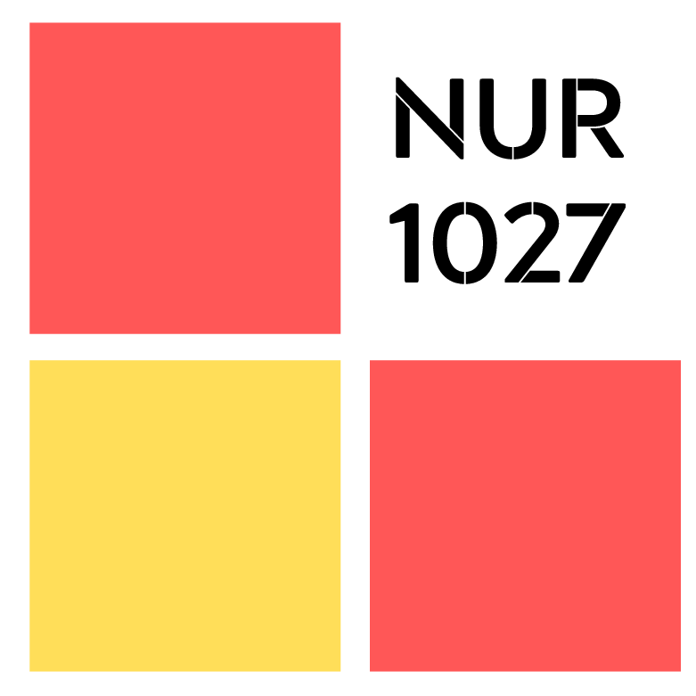

Welcome! This is the source repository for **NUR1027: Integrated Approaches to Research Appraisal and Utilization, Part 1**, hosted at: <https://nur1027.netlify.com>.

---

The course material is licensed [CC-BY](https://creativecommons.org/licenses/by/4.0/), meaning you are free to use it, change it, and remix it as long as you attribute me as the original course.  The _code_ is [MIT](https://opensource.org/licenses/MIT)-licensed.

The site itself is built on an amazing framework created by <a href='https://ines.io/'>Ines Montani</a>, originally created for her [spaCy course](https://course.spacy.io).  The front-end is powered by
[Gatsby](http://gatsbyjs.org/) and [Reveal.js](https://revealjs.com) and the
back-end code execution uses [Binder](https://mybinder.org).